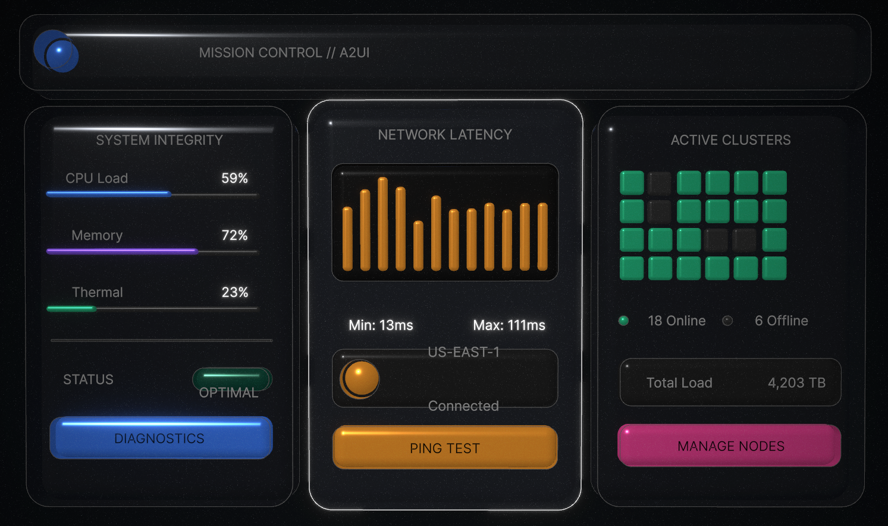

# A2UI Three.js Renderer

High-performance WebGL renderer for the A2UI (Agent-to-UI) protocol, built with React and Three.js. It renders streaming UI trees into a cinematic 3D scene with lighting, bloom, and hover interactions.



## Highlights
- Stream-driven rendering with `surfaceUpdate` and `dataModelUpdate` messages
- Yoga-like layout pass that computes absolute positions for WebGL
- Three.js scene with depth, parallax, and post-processing
- Live protocol inspector panel for debugging updates
- Modular component mapping for cards, text, buttons, rows, and columns

## Overview
This project demonstrates a GPU-accelerated renderer for A2UI-style component trees. A mock stream emits progressive updates, which are laid out in a simplified flexbox pass and then rendered as interactive 3D cards, text, and controls.

## Architecture at a glance
```
Mock Stream (A2UI messages)
  -> App.tsx (message handling + state)
    -> services/layoutEngine.ts (layout computation)
      -> components/Renderer3D.tsx (scene + postFX)
        -> components/A2UINode.tsx (node mapping)
```

## Protocol support (current)
- Messages: `heartbeat`, `surfaceUpdate`, `dataModelUpdate`
- Components: `Surface`, `Row`, `Column`, `Card`, `Text`, `Button`

## Tech stack
- React + Vite
- Three.js via `@react-three/fiber` and `@react-three/drei`
- `@react-three/postprocessing` for bloom, noise, and vignette
- Tailwind (via CDN) for the inspector panel UI

## Project layout
- `App.tsx` main UI and stream loop
- `components/Renderer3D.tsx` scene setup and effects
- `components/A2UINode.tsx` component-to-geometry mapping
- `services/layoutEngine.ts` layout computation
- `services/mockStream.ts` simulated A2UI stream
- `types.ts` shared TypeScript types
- `docs/TECHNICAL_DESIGN_DOC.md` architecture and roadmap notes

## Getting started
1) Install dependencies
```bash
npm install
```

2) Start the dev server
```bash
npm run dev
```

3) Build and preview
```bash
npm run build
npm run preview
```

## Configuration
- This demo runs fully offline using the mock stream.
- If you connect a real A2UI stream, put secrets in `.env.local` and keep them out of git.

## Extending the renderer
- Add new component mappings in `components/A2UINode.tsx`.
- Update sizing and layout rules in `services/layoutEngine.ts`.
- Replace `services/mockStream.ts` with a real SSE/WebSocket source.
- Tune lighting and post-processing in `components/Renderer3D.tsx`.

## Technical documentation
- [`docs/TECHNICAL_DESIGN_DOC.md`](./docs/TECHNICAL_DESIGN_DOC.md)

## Notes and limitations
- The layout engine is intentionally simplified and does not implement full Yoga semantics.
- No automated tests are configured for this repo.

## License
MIT. See `LICENSE`.
